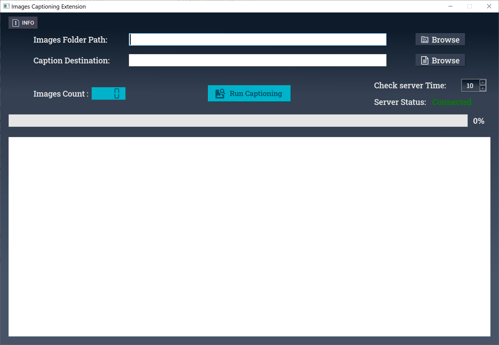

# Image-Captioning-Extension-for-LM-Studio
This is a Fork from https://github.com/lachhabw/Image-Captioning-Extension-for-LM-Studio  
This fork was created as an underdeveloped and Tested version, for the last releases check the original Repo    
# New Feature added :  
- Improved GUI
- Server Status: LMStudio server status Connected, Not connected  
- Images count: count of the images in the selected folder  
- If the user didn't choose the captioning folder the captions will be saved to the same images folder
- Play sound when finished captioning
- Change the server's check  interval time


## Snapshot



**Installation**
===============

### Automated Installation

1. Open a terminal and navigate to your desired location.
2. Clone the repository: `git clone https://github.com/MMoneer/Image-Captioning-Extension-for-LM-Studio.git`
3. Run the installation script for your platform:
	* **Windows**: `install_win.bat`
	* **Linux and Mac**: `install_Linux_Mac.sh`

### Manual Installation

1. Clone the repository: `git clone https://github.com/MMoneer/Image-Captioning-Extension-for-LM-Studio.git`
2. Create a new Python environment and activate it:
	* `python -m venv myenv`
	* `myenv\Scripts\activate` (on Windows) or `source myenv/bin/activate` (on Linux and Mac)
3. Navigate to the `Image-Captioning-Extension-for-LM-Studio` folder using `cd`.
4. Install the required packages: `pip install -r requirements.txt`

**Running the Script**
=====================

### Using the Script

1. Run the script using:
	* **Windows**: `run_win.bat`
	* **Linux and Mac**: `run_Linux_Mac.sh`

### Using the Executable (EXE)

1. Unzip the file.
2. Run the EXE file.

Description Below from the Original Repo:  
## Brief

This repository contains an unofficial extension for [LM Studio](https://lmstudio.ai) designed to automate the process of generating text captions for images. It allows users to utilize LM Studio's image text models like [llava](https://huggingface.co/jartine/llava-v1.5-7B-GGUF) to caption images automatically.


## Workflow Explanation

The extension operates by reading a folder of images provided by the user. It sends requests to the LM Studio server for caption generation for each image in the folder. Upon receiving the captions from the server, it saves the generated captions into text files in a specified destination folder. The application incorporates a progress bar that becomes visible while the captioning process is ongoing. Additionally, it includes an embedded terminal that displays the status of processed files, indicating whether they were successful or encountered failures.

## Setup Instructions

### Using Python Virtual Environment

1. Create a Python virtual environment:
   ```bash
   python -m venv local
   ```
2. Install dependencies:
   ```bash
   .\local\Scripts\pip install openai==1.12.0
   ```
3. Run the tool:
   ```bash
   .\local\Scripts\python main.py
   ```

### Using Executables

1. Download the pre-built executable from the releases section.
2. Double-click the executable to run the tool.


## Notes

- Before using the extension, ensure that LM Studio is operating in server mode and that the image text model is loaded with the appropriate prompt template.
- Be sure to adjust the `config.ini` file to match your server settings. The default configuration is as follows:
  ```ini
  [OpenAI]
  base_url = http://localhost:1234/v1
  api_key = not-needed
  ```
- It's important to enable "Apply Prompt Formatting" in LM Studio because this formatting is not applied on the client side. Failure to do so may result in unexpected behavior and poor quality results.
- Supported image formats include PNG, JPEG, and JPG. Formats such as AVIF and WebP are not supported.

